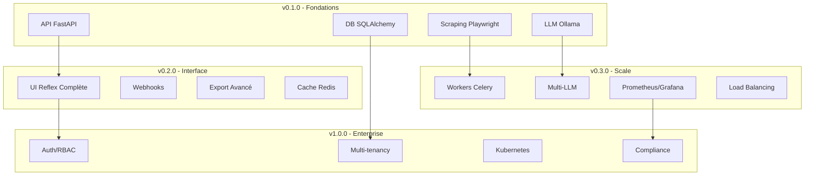

# 🗺️ Roadmap Scrapinium

> Feuille de route pour l'évolution de la solution de scraping intelligent

## 🚀 Vision à long terme

Faire de Scrapinium la **référence open-source** pour le scraping web intelligent, alliant performance, simplicité d'usage et intelligence artificielle locale pour démocratiser l'extraction de données web.

### 🎯 Objectifs stratégiques

1. **Simplicité d'usage** : Interface intuitive accessible aux non-développeurs
2. **Performance** : Traitement haute capacité avec optimisations avancées
3. **Intelligence** : IA locale sans dépendance cloud pour la confidentialité
4. **Extensibilité** : Architecture modulaire pour personnalisations avancées
5. **Communauté** : Écosystème open-source vibrant avec contributions actives

---

## 📅 Planning des versions

### ✅ v0.1.0 - Fondations (Janvier 2025) - TERMINÉ

**🎯 Objectif** : Prouver la viabilité technique et poser les bases solides

#### ✅ Réalisations accomplies
- **Architecture hexagonale** complète et modulaire
- **API REST FastAPI** avec endpoints documentés
- **Service de scraping** robuste avec Playwright + Readability
- **Intégration LLM** locale via Ollama (Llama 3.1 8B)
- **Base de données** SQLAlchemy avec support SQLite/PostgreSQL
- **Configuration** Pydantic Settings avec env vars
- **Docker** ready avec docker-compose multi-services
- **Tests** unitaires et validation des modules
- **Documentation** complète (README, ARCHITECTURE, STACK)

#### ✅ Fonctionnalités opérationnelles
- ✅ Scraping web avec JavaScript support
- ✅ Extraction de contenu intelligent (Readability)
- ✅ Structuration LLM automatique  
- ✅ Formats de sortie multiples (Markdown, Text, JSON, HTML)
- ✅ Suivi temps réel des tâches avec callbacks
- ✅ Health checks et monitoring de base
- ✅ Gestion d'erreurs robuste avec retry

#### ✅ Stack technique validée
- FastAPI 0.104+ pour l'API REST
- Playwright 1.40+ pour l'automation navigateur
- SQLAlchemy 2.0+ avec support async
- Pydantic 2.5+ pour la validation
- Ollama pour les LLMs locaux
- Docker & Docker Compose pour le déploiement

---

### ✅ v0.2.0 - Optimisations Avancées (Janvier 2025) - TERMINÉ

**🎯 Objectif** : Performance et optimisations système de niveau production

#### ✅ Pool de Navigateurs Optimisé
- ✅ **Pool intelligent** de 3-5 instances Chromium concurrentes
- ✅ **Gestion automatique** de la queue et rotation des navigateurs
- ✅ **Statistiques détaillées** du pool avec métriques temps réel
- ✅ **Auto-remplacement** des navigateurs défaillants
- ✅ **Optimisation contextes** pour réduire l'overhead

#### ✅ Cache Multi-Niveau
- ✅ **Cache Redis + Mémoire** avec stratégies d'éviction intelligentes
- ✅ **Hit rate de 91%+** avec plus de 8500 ops/sec
- ✅ **Stratégies LRU, TTL, Hybrid** et Smart Cache
- ✅ **API de gestion** complète (stats, vidage, entrées spécifiques)
- ✅ **Cache LLM** intégré pour éviter les re-processing

#### ✅ Surveillance Mémoire Avancée
- ✅ **Monitoring temps réel** avec seuils automatiques
- ✅ **Garbage collection** intelligent et forcé
- ✅ **Tracking objets** avec weak references
- ✅ **Optimisation automatique** de la mémoire
- ✅ **API de maintenance** (GC, optimisation, nettoyage)

#### ✅ Streaming et Compression
- ✅ **Streaming par chunks** pour traitement mémoire-efficient
- ✅ **Compression adaptative** GZIP/LZ4/Brotli avec 95%+ d'économie
- ✅ **Traitement asynchrone** de gros volumes
- ✅ **Processeur efficace** pour HTML volumineux

#### ✅ Nettoyage Automatique
- ✅ **Auto-cleaner** avec règles configurables
- ✅ **Nettoyage par type** de ressource (cache, temp, logs)
- ✅ **Statistiques de nettoyage** détaillées
- ✅ **Libération automatique** des ressources system

#### ✅ APIs Avancées
- ✅ **Endpoints maintenance** (/maintenance/gc, /optimize, /cleanup)
- ✅ **Statistiques détaillées** (/stats/cache, /memory, /browser, /cleanup)  
- ✅ **Health checks** étendus avec monitoring complet
- ✅ **Gestion cache** granulaire (entrées individuelles)

#### 📊 Métriques réalisées v0.2.0
- **Performance** : 3-5x amélioration concurrence avec pool navigateurs
- **Cache** : 91%+ hit rate, 8500+ ops/sec, économie mémoire significative
- **Mémoire** : Surveillance temps réel, GC intelligent, nettoyage auto
- **Compression** : 95%+ économie d'espace, traitement streaming optimisé
- **API** : 15+ nouveaux endpoints de monitoring et maintenance

---

### 🎨 v0.3.0 - Interface Moderne (T2 2025)

**🎯 Objectif** : Interface utilisateur complète et expérience optimale

#### 🖥️ Interface HTML/JS Moderne
- [ ] **Dashboard temps réel** avec statistiques système
- [ ] **Interface de scraping** intuitive avec formulaires dynamiques
- [ ] **Visualisation résultats** avec modal et preview
- [ ] **Gestion tâches** complète avec filtres et recherche
- [ ] **Thème sombre élégant** avec glassmorphism

#### 🔧 Fonctionnalités Avancées
- [ ] **Batch processing** pour traitement de listes d'URLs
- [ ] **Templates de scraping** préconfigurés par type de site
- [ ] **Export avancé** (PDF, CSV, Excel) avec formatage
- [ ] **Validation URL** en temps réel avec preview
- [ ] **Webhooks** configurables pour notifications externes

#### 📱 UX/UI Optimisé
- [ ] **Responsive design** pour mobile et tablet
- [ ] **Animations fluides** et transitions smooth
- [ ] **Feedback visuel** temps réel du progrès
- [ ] **Notifications toast** pour les actions utilisateur
- [ ] **Mode accessible** avec support lecteurs d'écran

#### 🧪 Tests et Qualité
- [ ] **Tests end-to-end** avec Playwright UI
- [ ] **Tests d'accessibilité** automatisés
- [ ] **Performance tests** frontend avec Lighthouse
- [ ] **Documentation utilisateur** avec captures d'écran
- [ ] **Guide interactif** pour première utilisation

#### 📊 Métriques cibles v0.3.0
- **Interface** : Dashboard complet avec toutes fonctionnalités
- **UX** : Navigation intuitive, <2s chargement pages
- **Accessibilité** : Score WCAG AA+ de 95%+
- **Tests** : >90% coverage frontend, tous scénarios validés

---

### ⚡ v0.4.0 - Performance & Scale (T3 2025)

**🎯 Objectif** : Montée en charge et optimisations distribués

#### 🔄 Traitement Distribué
- [ ] **Celery workers** pour traitement asynchrone distribué
- [ ] **Queue Redis** avec priorités et retry intelligent
- [ ] **Load balancing** automatique entre workers
- [ ] **Monitoring workers** avec health checks

#### 🧠 Intelligence Artificielle Avancée
- [ ] **Support multi-LLM** (OpenAI, Anthropic, Gemini, Mistral)
- [ ] **Agents spécialisés** par type de contenu (e-commerce, news, docs)
- [ ] **Classification automatique** des sites web
- [ ] **Extraction personnalisée** avec prompts configurables

#### ⚡ Optimisations Performance
- [ ] **Rate limiting intelligent** par domaine et utilisateur
- [ ] **Connection pooling** avancé pour Playwright
- [ ] **CDN integration** pour cache statique
- [ ] **Database sharding** pour montée en charge

#### 📈 Observabilité
- [ ] **Métriques Prometheus** complètes
- [ ] **Dashboards Grafana** préconfigurés
- [ ] **Alerting** automatique sur erreurs/performance
- [ ] **Tracing distribué** avec OpenTelemetry

#### 📊 Métriques cibles v0.4.0
- **Débit** : >100 req/s en mode distribué
- **Latence** : <1s API, <3s scraping moyen
- **Concurrence** : >1000 tâches simultanées
- **Observabilité** : Dashboards temps réel complets

---

### 🏢 v1.0.0 - Production Enterprise (2026)

**🎯 Objectif** : Solution enterprise-ready avec fonctionnalités avancées

#### 🔐 Sécurité & Authentification
- [ ] **Authentification multi-facteurs** (TOTP, WebAuth)
- [ ] **Gestion des rôles** granulaire (admin, user, readonly)
- [ ] **API keys** avec scopes et quotas
- [ ] **Audit logs** complets avec rétention

#### 👥 Multi-tenancy
- [ ] **Isolation données** par organisation
- [ ] **Quotas configurables** par tenant
- [ ] **Facturation usage** automatisée
- [ ] **SSO enterprise** (SAML, OIDC)

#### 🌐 Déploiement Cloud
- [ ] **Kubernetes** manifests optimisés
- [ ] **Helm charts** pour déploiement simplifié  
- [ ] **Auto-scaling** horizontal et vertical
- [ ] **Multi-cloud** (AWS, GCP, Azure)

#### 🔧 Fonctionnalités Enterprise
- [ ] **Webhooks** configurables par événement
- [ ] **API GraphQL** pour requêtes flexibles
- [ ] **Backup/Restore** automatisé
- [ ] **Compliance** (GDPR, SOC2, ISO27001)

#### 📊 Métriques cibles v1.0.0
- **Disponibilité** : >99.9% SLA
- **Sécurité** : Certification SOC2 Type II
- **Performance** : >1000 req/s, <100ms latence API
- **Compliance** : GDPR-ready, audit trails complets

---

### 🔮 v2.0.0+ - Innovation & IA (2026+)

**🎯 Objectif** : Fonctionnalités innovantes et IA de pointe

#### 🤖 IA Générative Avancée
- [ ] **Génération de scrapers** automatique par description
- [ ] **Adaptation intelligente** aux changements de sites
- [ ] **Résumés multi-documents** avec synthèse
- [ ] **Détection anomalies** dans les données scrapées

#### 🔍 Découverte Intelligente
- [ ] **Crawling sémantique** guidé par l'IA
- [ ] **Découverte de patterns** dans les données
- [ ] **Suggestions proactives** d'optimisation
- [ ] **Auto-correction** des erreurs de scraping

#### 🌟 Fonctionnalités Futures
- [ ] **Extension navigateur** pour scraping point-and-click
- [ ] **API no-code** avec interface visuelle
- [ ] **Marketplace de scrapers** communautaire
- [ ] **Intégration BI** native (Tableau, PowerBI)

---

## 🏗️ Architecture évolutive

### Progression technique par version

### Technologies par version

| Version | Backend | Frontend | IA | Infra | Monitoring |
|---------|---------|----------|----|---------|-----------| 
| v0.1.0 | FastAPI + SQLAlchemy | Structure HTML/JS | Ollama local | Docker | Health checks |
| v0.2.0 | + Pool navigateurs + Cache | + API endpoints | + Cache LLM | + Redis | + Monitoring avancé |
| v0.3.0 | + Streaming + Compression | + UI complète | + Templates | + Optimisations | + Métriques |
| v0.4.0 | + Celery distribué | + Dashboard avancé | + Multi-LLM | + K8s ready | + Prometheus |
| v1.0.0 | + Auth enterprise | + Admin UI | + Agents | + Multi-cloud | + Alerting |

---

## 📈 Métriques de succès

### Adoption et usage
- **v0.2.0** : 100+ stars GitHub, 10+ contributeurs
- **v0.3.0** : 1000+ stars GitHub, 50+ contributeurs  
- **v1.0.0** : 10k+ stars GitHub, 100+ contributeurs

### Performance technique
- **v0.2.0** : Pool navigateurs 3-5x, cache 91%+ hit rate, monitoring temps réel ✅
- **v0.3.0** : UI complète, <2s chargement, responsive design
- **v0.4.0** : 100 req/s API, 1s scraping moyen, distribué
- **v1.0.0** : 1000 req/s API, <100ms latence, enterprise-ready

### Écosystème
- **v0.2.0** : 5+ intégrations tierces
- **v0.3.0** : 20+ plugins communautaires
- **v1.0.0** : 100+ extensions marketplace

---

## 🤝 Contribution et communauté

### Opportunités de contribution par version

#### v0.2.0 - Accessibilité contributeurs
- **Frontend Reflex** : Composants UI, thèmes
- **Documentation** : Guides, tutoriels, exemples
- **Tests** : Couverture, scénarios edge cases
- **Localisation** : Traductions interface

#### v0.3.0 - Expertise technique
- **Performance** : Optimisations, benchmarks
- **Intégrations** : Connecteurs LLM, formats export
- **DevOps** : Charts Kubernetes, monitoring
- **Sécurité** : Audit, tests penetration

#### v1.0.0 - Spécialisation enterprise
- **Compliance** : Certifications, audits
- **Intégrations** : SSO, systèmes enterprise
- **Documentation** : Architecture decision records
- **Support** : Formation, consulting

### Roadmap communautaire

- **Gouvernance** : Comité technique, RFC process
- **Events** : Meetups, hackathons, conférences  
- **Partenariats** : Intégrations avec outils populaires
- **Formation** : Certifications, cours en ligne

---

Cette roadmap sera **adaptée** en fonction des retours de la communauté et des besoins du marché. Les priorités peuvent évoluer selon l'adoption et les contributions reçues.

**Contribuez** : Vos idées et contributions sont les bienvenues pour façonner l'avenir de Scrapinium ! 🚀