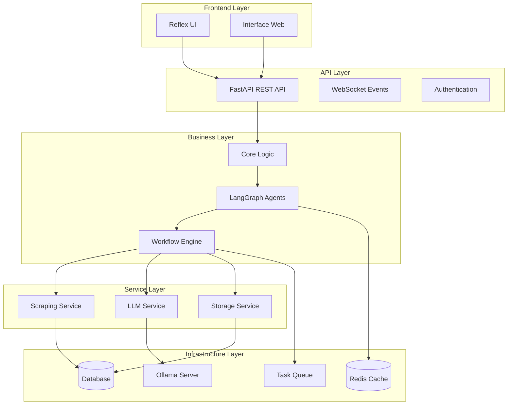
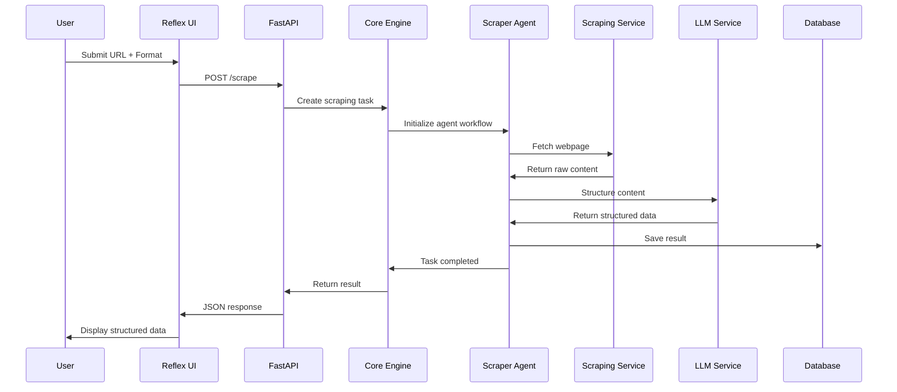
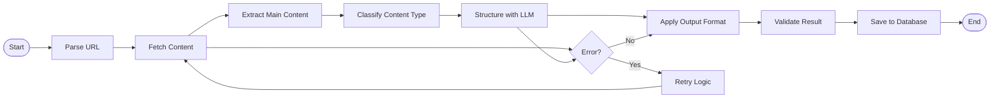

# 🏗️ Architecture Scrapinium

> Documentation technique de l'architecture logicielle

## 🎯 Principes Architecturaux

### Philosophie
- **Modulaire** : Composants découplés et réutilisables
- **Extensible** : Support facile de nouveaux LLMs et formats
- **Performant** : Traitement asynchrone et parallèle
- **Sécurisé** : Gestion sécurisée des clés et données
- **Observable** : Monitoring et logs complets

### Patterns
- **Hexagonal Architecture** : Séparation métier/infrastructure
- **Agent Pattern** : Agents autonomes LangGraph
- **Repository Pattern** : Abstraction de la persistance
- **Factory Pattern** : Création dynamique des LLMs
- **Observer Pattern** : Événements et notifications

---

## 🏛️ Vue d'ensemble



---

## 📦 Structure des Modules

### `/src/scrapinium/`

```
scrapinium/
├── core/              # 🧠 Logique métier centrale
│   ├── engine.py      # Moteur principal
│   ├── workflow.py    # Orchestration des tâches
│   └── events.py      # Système d'événements
│
├── agents/            # 🤖 Agents LangGraph
│   ├── scraper.py     # Agent de scraping
│   ├── extractor.py   # Agent d'extraction
│   ├── formatter.py   # Agent de formatage
│   └── validator.py   # Agent de validation
│
├── scraping/          # 🕷️ Modules de scraping
│   ├── browser.py     # Gestion navigateur
│   ├── parser.py      # Parsing HTML/XML
│   ├── extractor.py   # Extraction de contenu
│   └── filters.py     # Filtres et nettoyage
│
├── llm/               # 🧠 Intégrations LLM
│   ├── factory.py     # Factory des LLMs
│   ├── ollama.py      # Client Ollama
│   ├── openai.py      # Client OpenAI
│   ├── anthropic.py   # Client Anthropic
│   └── mistral.py     # Client Mistral
│
├── api/               # 🌐 API REST
│   ├── app.py         # Application FastAPI
│   ├── routes/        # Endpoints API
│   ├── middleware/    # Middlewares
│   └── schemas/       # Schémas Pydantic
│
├── ui/                # 🎨 Interface utilisateur
│   ├── app.py         # Application Reflex
│   ├── pages/         # Pages interface
│   ├── components/    # Composants réutilisables
│   └── styles/        # Styles CSS
│
├── models/            # 📊 Modèles de données
│   ├── base.py        # Modèles de base
│   ├── scraping.py    # Modèles scraping
│   ├── llm.py         # Modèles LLM
│   └── user.py        # Modèles utilisateur
│
├── config/            # ⚙️ Configuration
│   ├── settings.py    # Paramètres application
│   ├── database.py    # Configuration BDD
│   └── logging.py     # Configuration logs
│
└── utils/             # 🛠️ Utilitaires
    ├── crypto.py      # Chiffrement
    ├── validators.py  # Validateurs
    ├── formatters.py  # Formatage données
    └── helpers.py     # Fonctions utilitaires
```

---

## 🔄 Flux de Données

### 1. Scraping Request Flow



### 2. Agent Workflow



---

## 🏗️ Couches Architecturales

### 1. Présentation (UI/API)
- **Responsabilité** : Interface utilisateur et endpoints API
- **Technologies** : Reflex, FastAPI, WebSocket
- **Patterns** : MVC, REST, Event-driven

### 2. Application (Core/Agents)
- **Responsabilité** : Logique métier et orchestration
- **Technologies** : LangGraph, Workflow Engine
- **Patterns** : Agent, Command, Observer

### 3. Domaine (Models/Services)
- **Responsabilité** : Modèles métier et services
- **Technologies** : Pydantic, SQLAlchemy
- **Patterns** : Repository, Factory, Strategy

### 4. Infrastructure (Database/External)
- **Responsabilité** : Persistance et services externes
- **Technologies** : SQLite/PostgreSQL, Redis, Ollama
- **Patterns** : Adapter, Gateway, Circuit Breaker

---

## 🤖 Architecture des Agents

### Agent Orchestration avec LangGraph

```python
from langgraph import StateGraph, END

def create_scraping_workflow():
    workflow = StateGraph()
    
    # Nodes
    workflow.add_node("fetch", fetch_content_node)
    workflow.add_node("extract", extract_content_node)
    workflow.add_node("structure", structure_with_llm_node)
    workflow.add_node("format", format_output_node)
    workflow.add_node("validate", validate_result_node)
    
    # Edges
    workflow.add_edge("fetch", "extract")
    workflow.add_edge("extract", "structure")
    workflow.add_edge("structure", "format")
    workflow.add_edge("format", "validate")
    workflow.add_edge("validate", END)
    
    # Conditional edges
    workflow.add_conditional_edges(
        "validate",
        should_retry,
        {"retry": "structure", "end": END}
    )
    
    return workflow.compile()
```

### Types d'Agents

1. **Scraper Agent** : Navigation et extraction
2. **Extractor Agent** : Analyse et structuration
3. **Formatter Agent** : Conversion de format
4. **Validator Agent** : Vérification qualité
5. **Monitor Agent** : Surveillance performance

---

## 🔒 Sécurité

### Chiffrement des Clés API
```python
from cryptography.fernet import Fernet

class APIKeyManager:
    def __init__(self, secret_key: str):
        self.cipher = Fernet(secret_key.encode())
    
    def encrypt_key(self, api_key: str) -> str:
        return self.cipher.encrypt(api_key.encode()).decode()
    
    def decrypt_key(self, encrypted_key: str) -> str:
        return self.cipher.decrypt(encrypted_key.encode()).decode()
```

### Validation et Sanitization
- Validation stricte des URLs
- Sanitization du contenu extrait
- Rate limiting par utilisateur
- Validation des formats de sortie

---

## 📊 Monitoring et Observabilité

### Métriques Collectées
- Temps de réponse par endpoint
- Taux de succès/échec du scraping
- Utilisation des LLMs (tokens, latence)
- Performance des agents
- Utilisation des ressources système

### Logging Structure
```json
{
  "timestamp": "2024-06-21T10:30:00Z",
  "level": "INFO",
  "service": "scraper_agent",
  "trace_id": "abc123",
  "user_id": "user456",
  "url": "https://example.com",
  "duration_ms": 1250,
  "status": "success",
  "llm_tokens": 324
}
```

---

## 🚀 Déploiement

### Conteneurisation
- **Application** : Container Python multi-stage
- **Services** : Redis, Ollama, PostgreSQL
- **Orchestration** : Docker Compose (dev), Kubernetes (prod)

### Scalabilité
- Load balancing avec Nginx
- Scaling horizontal des workers
- Cache distribué Redis
- Queue de tâches Celery

---

## 🔄 Évolution Architecture

### Phase 1 (MVP)
- Architecture monolithique modulaire
- SQLite + Redis local
- Ollama local

### Phase 2 (Scale)
- Microservices sélectifs
- PostgreSQL + Redis cluster
- Multi-node Ollama

### Phase 3 (Enterprise)
- Architecture distribuée
- Multi-tenant
- Cloud-native deployment

---

<div align="center">
  <b>🏗️ Architecture évolutive et maintenable</b><br>
  <i>Conçue pour grandir avec vos besoins</i>
</div>