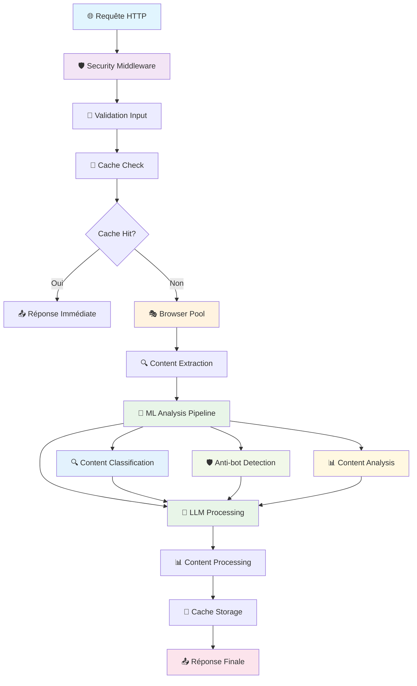

# Architecture Scrapinium - Guide Développeur

## 🏗️ Vue d'Ensemble Architecture

Scrapinium suit une architecture modulaire enterprise-grade optimisée pour la performance, la scalabilité et la maintenabilité.

```
┌─────────────────────────────────────────────────────────────┐
│                    SCRAPINIUM ARCHITECTURE                  │
├─────────────────────────────────────────────────────────────┤
│  🌐 Frontend (Web Interface)                               │
│  ├── Templates Jinja2 + JavaScript vanilla                │
│  ├── Dashboard temps réel + Charts.js                     │
│  └── Interface scraping responsive                        │
├─────────────────────────────────────────────────────────────┤
│  🔌 API Layer (FastAPI) - ARCHITECTURE MODULAIRE v0.4.0  │
│  ├── routers/core.py (/, /health, /api)                  │
│  ├── routers/scraping.py (tâches de scraping)            │
│  ├── routers/statistics.py (monitoring système)          │
│  ├── routers/cache.py (administration cache)             │
│  ├── routers/maintenance.py (maintenance système)        │
│  ├── routers/performance.py (optimisation perf)          │
│  ├── Middleware sécurité (Rate limiting, Headers)        │
│  ├── Validation inputs + Serialization                   │
│  └── Background tasks + Progress tracking                 │
├─────────────────────────────────────────────────────────────┤
│  🧠 Business Logic - COUCHE SERVICES v0.4.0              │
│  ├── services/scraping_service.py (ScrapingTaskService)  │
│  ├── LLM Integration (Ollama/OpenAI)                     │
│  ├── ML Pipeline (Intelligence Layer)                    │
│  ├── Content Processing Pipeline                         │
│  ├── Task Management (TaskManager thread-safe)          │
│  └── Exception Hierarchy (gestion erreurs centralisée)   │
├─────────────────────────────────────────────────────────────┤
│  🎭 Browser Pool Management                               │
│  ├── Playwright Pool (3-5 instances)                     │
│  ├── Queue management + Load balancing                   │
│  ├── Resource monitoring + Auto-scaling                  │
│  └── Error handling + Recovery                           │
├─────────────────────────────────────────────────────────────┤
│  💾 Cache Layer (Multi-niveau)                           │
│  ├── Memory Cache (LRU + TTL)                           │
│  ├── Redis Cache (Distributed)                          │
│  ├── Smart Cache Strategies                             │
│  └── Cache invalidation + Warming                       │
├─────────────────────────────────────────────────────────────┤
│  🗄️ Data Layer                                            │
│  ├── SQLAlchemy ORM + AsyncIO                           │
│  ├── PostgreSQL (Production)                            │
│  ├── SQLite (Development)                               │
│  └── Migration management                               │
├─────────────────────────────────────────────────────────────┤
│  🛡️ Security Layer                                        │
│  ├── Rate Limiting + DoS Protection                     │
│  ├── Input Validation + Sanitization                   │
│  ├── Security Headers + CORS                           │
│  └── Audit + Compliance                                │
├─────────────────────────────────────────────────────────────┤
│  📊 Observability                                        │
│  ├── Memory Monitoring + Metrics                       │
│  ├── Performance tracking                              │
│  ├── Structured Logging                                │
│  └── Health checks                                     │
└─────────────────────────────────────────────────────────────┘
```

## 🏛️ Modules Principaux

### 1. API Layer (`src/scrapinium/api/`) - ARCHITECTURE MODULAIRE v0.4.0

**Architecture FastAPI modulaire avec routers spécialisés et couche services**

```python
api/
├── app.py              # Application principale (149 lignes - orchestrateur)
├── routers/            # Routers modulaires par domaine (v0.4.0)
│   ├── core.py        # Endpoints racine (/, /health, /api)
│   ├── scraping.py    # Gestion tâches de scraping
│   ├── statistics.py  # Monitoring et métriques système
│   ├── cache.py       # Administration cache multi-niveau
│   ├── maintenance.py # Opérations de maintenance système
│   └── performance.py # Surveillance et optimisation
├── services/           # Couche services business logic (v0.4.0)
│   └── scraping_service.py # ScrapingTaskService avec patterns
├── task_manager.py     # Gestionnaire thread-safe des tâches
├── ml_manager.py       # Gestionnaire ML avec singleton
├── exception_handler.py # Gestion d'exceptions centralisée
└── validators.py       # Validation inputs sécurisée
```

**Patterns architecturaux v0.4.0:**
- ✅ **Router Pattern** : Séparation par domaine fonctionnel
- ✅ **Service Layer** : Logique métier extraite et centralisée  
- ✅ **Singleton Pattern** : Gestionnaires avec instances uniques
- ✅ **Dependency Injection** avec FastAPI
- ✅ **Exception Hierarchy** : Gestion d'erreurs typée et centralisée
- ✅ **Thread-Safe Managers** : TaskManager et MLManager avec RLock
- ✅ **Async/Await** pour performance optimale
- ✅ **Background Tasks** pour tâches longues
- ✅ **Middleware Pipeline** pour sécurité
- ✅ **Request/Response Models** avec Pydantic

**Améliorations v0.4.0:**
- **Réduction complexité** : app.py 1071 → 149 lignes (-86%)
- **Maintenabilité** : Code modulaire avec responsabilités séparées
- **Testabilité** : Services isolés et facilement mockables
- **Évolutivité** : Ajout de fonctionnalités simplifié
- **Code Quality** : Respect des principes SOLID et Clean Code

### 2. Scraping Engine (`src/scrapinium/scraping/`)

**Moteur de scraping haute performance avec pool de navigateurs**

```python
scraping/
├── service.py          # Orchestrateur principal
├── browser.py          # Pool de navigateurs Playwright
├── extractor.py        # Extraction de contenu
├── processor.py        # Traitement de données
├── strategies/         # Stratégies d'extraction
│   ├── html.py        # Extraction HTML/CSS
│   ├── javascript.py  # Rendu JavaScript
│   └── adaptive.py    # Stratégie adaptative
└── utils.py           # Utilitaires scraping
```

**Architecture Browser Pool:**

```python
class BrowserPool:
    """Pool de navigateurs optimisé pour performance"""
    
    def __init__(self, max_browsers: int = 5):
        self.browsers: Queue[Browser] = Queue()
        self.active_browsers: Dict[str, BrowserInstance] = {}
        self.stats = BrowserPoolStats()
        
    async def acquire_browser(self) -> BrowserContext:
        """Acquisition thread-safe d'un navigateur"""
        
    async def release_browser(self, browser: BrowserContext):
        """Libération et nettoyage automatique"""
        
    def get_pool_stats(self) -> BrowserPoolStats:
        """Métriques temps réel du pool"""
```

### 3. LLM Integration (`src/scrapinium/llm/`)

**Intégration multi-providers avec fallback intelligents**

```python
llm/
├── providers/          # Providers LLM
│   ├── ollama.py      # Ollama local
│   ├── openai.py      # OpenAI API
│   ├── anthropic.py   # Claude API
│   └── google.py      # Gemini API
├── manager.py          # Gestionnaire multi-providers
├── prompts/           # Templates de prompts
├── cache.py           # Cache spécialisé LLM
└── streaming.py       # Streaming responses
```

**Pattern Provider:**

```python
class LLMProvider(Protocol):
    """Interface commune pour tous les providers LLM"""
    
    async def health_check(self) -> bool:
        """Vérification de santé du provider"""
        
    async def process_content(
        self, 
        content: str, 
        instructions: str = "",
        model: str = "default"
    ) -> LLMResponse:
        """Traitement de contenu avec LLM"""
        
    async def stream_process(
        self, 
        content: str, 
        instructions: str = ""
    ) -> AsyncIterator[str]:
        """Traitement en streaming"""
```

### 4. Cache System (`src/scrapinium/cache/`)

**Système de cache multi-niveau avec stratégies intelligentes**

```python
cache/
├── manager.py          # Gestionnaire principal
├── backends/          # Implémentations cache
│   ├── memory.py      # Cache mémoire LRU
│   ├── redis.py       # Cache Redis distribué
│   └── hybrid.py      # Cache hybride intelligent
├── strategies/        # Stratégies de cache
│   ├── lru.py        # Least Recently Used
│   ├── ttl.py        # Time To Live
│   ├── smart.py      # Stratégie intelligente
│   └── adaptive.py   # Cache adaptatif
├── serializers.py     # Sérialiseurs optimisés
└── invalidation.py    # Invalidation intelligente
```

**Cache Multi-Niveau:**

```python
class CacheManager:
    """Gestionnaire de cache multi-niveau"""
    
    def __init__(self):
        self.l1_cache = MemoryCache(max_size=1000)  # L1: Mémoire
        self.l2_cache = RedisCache(url=redis_url)   # L2: Redis
        self.strategy = SmartCacheStrategy()
        
    async def get(self, key: str) -> Optional[Any]:
        """Récupération avec fallback L1 → L2"""
        
    async def set(self, key: str, value: Any, ttl: int = 3600):
        """Stockage intelligent multi-niveau"""
        
    async def invalidate(self, pattern: str):
        """Invalidation par pattern"""
```

### 5. Security Layer (`src/scrapinium/security/`)

**Sécurité enterprise avec conformité standards**

```python
security/
├── rate_limiter.py     # Rate limiting avancé
├── input_validator.py  # Validation inputs stricte
├── headers.py          # Headers sécurité
├── config_security.py # Configuration sécurisée
├── auth/              # Authentification (future)
├── monitoring/        # Monitoring sécurité
└── compliance/        # Conformité standards
```

**Pattern Security Middleware:**

```python
async def security_pipeline(request: Request, call_next):
    """Pipeline de sécurité multi-étapes"""
    
    # 1. Rate limiting
    await rate_limiter.check_limits(request)
    
    # 2. Input validation
    await input_validator.validate_request(request)
    
    # 3. Traitement
    response = await call_next(request)
    
    # 4. Security headers
    response = security_headers.apply_headers(response)
    
    return response
```

### 6. ML Pipeline (`src/scrapinium/ml/`)

**Intelligence artificielle intégrée pour un scraping adaptatif**

```python
ml/
├── ml_pipeline.py      # Pipeline ML principal
├── content_classifier.py # Classification contenu 
├── antibot_detector.py   # Détection anti-bot
├── content_analyzer.py   # Analyse sémantique
├── models/              # Modèles ML (future)
└── training/           # Training pipeline (future)
```

**Pipeline ML Pattern:**

```python
class MLPipeline:
    """Pipeline ML complet avec cache et parallélisation"""
    
    async def analyze_page(self, html: str, url: str) -> MLAnalysisResult:
        """Analyse intelligente d'une page web"""
        
        # Cache check
        cache_key = self._generate_cache_key(html, url)
        cached = self._get_from_cache(cache_key)
        if cached:
            return cached
        
        # Analyses parallèles pour performance
        classification_task = asyncio.create_task(
            self.content_classifier.classify_page(html, url)
        )
        
        bot_detection_task = asyncio.create_task(
            self.antibot_detector.analyze_page(html, headers, url)
        )
        
        classification, bot_detection = await asyncio.gather(
            classification_task, bot_detection_task
        )
        
        # Analyse sémantique
        content_features = await self.content_analyzer.analyze_content(
            html, classification.features['text_content'], url
        )
        
        # Construction du résultat
        result = MLAnalysisResult(
            classification=classification,
            bot_detection=bot_detection, 
            content_features=content_features,
            # ... autres champs
        )
        
        # Cache storage
        self._store_in_cache(cache_key, result)
        return result
```

**Analyseurs Spécialisés:**

```python
# ContentClassifier - Classification de contenu
class ContentClassifier:
    def classify_page(self, html: str, url: str) -> ClassificationResult:
        """Classifie le type et la qualité du contenu"""
        # Types: article, ecommerce, blog, forum, news, documentation
        # Qualité: high, medium, low, spam
        # Langue: fr, en, es, unknown

# AntibotDetector - Détection défis anti-bot  
class AntibotDetector:
    def analyze_page(self, html: str, headers: Dict) -> DetectionResult:
        """Détecte les défis anti-bot et génère stratégies d'évasion"""
        # Défis: cloudflare, recaptcha, rate_limiting, js_challenge
        # Stratégies: stealth_mode, rotation, delay_randomization

# ContentAnalyzer - Analyse sémantique
class ContentAnalyzer:
    def analyze_content(self, html: str, text: str) -> ContentFeatures:
        """Analyse sémantique complète du contenu"""
        # Métriques: mots, lisibilité, sentiment, topics, keywords
        # Structure: titres, listes, tableaux, médias
```

## 🔄 Flux de Données

### Workflow Scraping Complet



### Cycle de Vie d'une Tâche

```python
class ScrapingTask:
    """Cycle de vie complet d'une tâche de scraping"""
    
    async def execute(self):
        try:
            # 1. Initialisation
            self.status = TaskStatus.INITIALIZING
            await self.validate_input()
            
            # 2. Cache check
            cached_result = await self.check_cache()
            if cached_result:
                return cached_result
            
            # 3. Browser acquisition
            self.status = TaskStatus.ACQUIRING_BROWSER
            browser = await self.browser_pool.acquire()
            
            # 4. Content extraction
            self.status = TaskStatus.EXTRACTING
            raw_content = await self.extract_content(browser)
            
            # 5. LLM processing
            if self.use_llm:
                self.status = TaskStatus.PROCESSING_LLM
                structured_content = await self.llm_process(raw_content)
            else:
                structured_content = raw_content
            
            # 6. Post-processing
            self.status = TaskStatus.POST_PROCESSING
            final_content = await self.post_process(structured_content)
            
            # 7. Cache storage
            await self.store_in_cache(final_content)
            
            # 8. Completion
            self.status = TaskStatus.COMPLETED
            return final_content
            
        except Exception as e:
            self.status = TaskStatus.FAILED
            await self.handle_error(e)
            raise
        finally:
            await self.cleanup()
```

## 🗄️ Modèles de Données

### Core Models

```python
# src/scrapinium/models/schemas.py

class ScrapingTaskCreate(BaseModel):
    """Modèle de création de tâche"""
    url: HttpUrl
    output_format: OutputFormat = OutputFormat.MARKDOWN
    use_llm: bool = False
    custom_instructions: Optional[str] = None
    use_cache: bool = True
    priority: TaskPriority = TaskPriority.NORMAL
    
    @validator("url")
    def validate_url_security(cls, v):
        """Validation sécurisée de l'URL"""
        # Validation anti-SSRF, domaines bloqués, etc.
        return security_validator.validate_url(v)

class ScrapingResult(BaseModel):
    """Résultat de scraping avec métadonnées"""
    id: str
    url: str
    status: TaskStatus
    structured_content: Optional[str]
    metadata: TaskMetadata
    created_at: datetime
    completed_at: Optional[datetime]
    
class TaskMetadata(BaseModel):
    """Métadonnées riches de la tâche"""
    execution_time_ms: int
    tokens_used: Optional[int]
    content_length: int
    word_count: int
    reading_time_minutes: float
    cache_hit: bool
    browser_used: str
    llm_provider: Optional[str]
    security_score: float
```

### Database Schema

```sql
-- Structure optimisée pour performance
CREATE TABLE scraping_tasks (
    id UUID PRIMARY KEY DEFAULT gen_random_uuid(),
    url TEXT NOT NULL,
    status task_status NOT NULL DEFAULT 'pending',
    structured_content TEXT,
    metadata JSONB,
    created_at TIMESTAMP WITH TIME ZONE DEFAULT NOW(),
    completed_at TIMESTAMP WITH TIME ZONE,
    user_id UUID,
    
    -- Index pour performance
    INDEX idx_tasks_status ON scraping_tasks(status),
    INDEX idx_tasks_created ON scraping_tasks(created_at DESC),
    INDEX idx_tasks_url_hash ON scraping_tasks(md5(url))
);

-- Table d'audit sécurité
CREATE TABLE security_events (
    id UUID PRIMARY KEY DEFAULT gen_random_uuid(),
    event_type TEXT NOT NULL,
    severity security_severity NOT NULL,
    client_id TEXT,
    ip_address INET,
    user_agent TEXT,
    details JSONB,
    created_at TIMESTAMP WITH TIME ZONE DEFAULT NOW()
);
```

## ⚡ Patterns de Performance

### 1. Async/Await Optimisé

```python
class AsyncOptimizedService:
    """Service optimisé pour performance async"""
    
    async def process_multiple_urls(
        self, 
        urls: List[str],
        concurrency_limit: int = 10
    ) -> List[ScrapingResult]:
        """Traitement concurrent optimisé"""
        
        semaphore = asyncio.Semaphore(concurrency_limit)
        
        async def process_single_url(url: str) -> ScrapingResult:
            async with semaphore:
                return await self.scrape_url(url)
        
        # Execution en batch pour éviter l'overhead
        tasks = [process_single_url(url) for url in urls]
        results = await asyncio.gather(*tasks, return_exceptions=True)
        
        return [r for r in results if isinstance(r, ScrapingResult)]
```

### 2. Memory Management Avancé

```python
class MemoryOptimizedProcessor:
    """Traitement optimisé mémoire avec streaming"""
    
    async def process_large_content(
        self, 
        content: str,
        chunk_size: int = 1024 * 1024  # 1MB chunks
    ) -> AsyncIterator[str]:
        """Traitement par chunks pour gros contenus"""
        
        for i in range(0, len(content), chunk_size):
            chunk = content[i:i + chunk_size]
            processed_chunk = await self.process_chunk(chunk)
            
            # Yield immédiatement pour libérer la mémoire
            yield processed_chunk
            
            # Force garbage collection si nécessaire
            if i % (chunk_size * 10) == 0:
                await asyncio.sleep(0)  # Allow event loop
                gc.collect()
```

### 3. Cache Intelligent

```python
class SmartCacheStrategy:
    """Stratégie de cache intelligente basée sur l'usage"""
    
    def calculate_cache_priority(
        self, 
        url: str, 
        content_size: int,
        access_frequency: int
    ) -> CachePriority:
        """Calcul intelligent de priorité de cache"""
        
        # Facteurs de décision
        size_factor = 1.0 / (1 + content_size / 1024**2)  # Pénalité taille
        freq_factor = min(access_frequency / 10, 2.0)      # Bonus fréquence
        time_factor = self.get_temporal_factor(url)        # Tendance temporelle
        
        priority_score = size_factor * freq_factor * time_factor
        
        if priority_score > 1.5:
            return CachePriority.HIGH
        elif priority_score > 0.8:
            return CachePriority.MEDIUM
        else:
            return CachePriority.LOW
```

## 🔧 Configuration Avancée

### Environment Configuration

```python
# src/scrapinium/config/settings.py

class Settings(BaseSettings):
    """Configuration centralisée avec validation"""
    
    # === CORE ===
    app_name: str = "Scrapinium"
    app_version: str = "2.0.0"
    debug: bool = False
    environment: Environment = Environment.PRODUCTION
    
    # === DATABASE ===
    database_url: PostgresDsn
    database_pool_size: int = 20
    database_max_overflow: int = 30
    database_echo: bool = False
    
    # === CACHE ===
    redis_url: Optional[RedisDsn] = None
    cache_default_ttl: int = 3600
    cache_max_memory_mb: int = 512
    
    # === BROWSER POOL ===
    browser_pool_size: int = 5
    browser_timeout_seconds: int = 30
    browser_max_age_minutes: int = 60
    
    # === LLM ===
    ollama_host: str = "http://localhost:11434"
    openai_api_key: Optional[str] = None
    anthropic_api_key: Optional[str] = None
    
    # === SECURITY ===
    security_level: SecurityLevel = SecurityLevel.PRODUCTION
    rate_limit_per_minute: int = 60
    rate_limit_per_hour: int = 1000
    rate_limit_burst: int = 10
    
    # === PERFORMANCE ===
    max_concurrent_tasks: int = 100
    task_timeout_seconds: int = 300
    memory_limit_mb: int = 2048
    
    class Config:
        env_file = ".env"
        case_sensitive = False
        
    @validator("database_url")
    def validate_database_url(cls, v):
        """Validation sécurisée de l'URL de base de données"""
        if not v.startswith(("postgresql://", "sqlite://")):
            raise ValueError("URL de base de données non supportée")
        return v
```

### Configuration par Environnement

```yaml
# config/environments/production.yaml
database:
  pool_size: 50
  max_overflow: 100
  echo: false
  
browser_pool:
  size: 10
  timeout: 45
  max_age: 30
  
cache:
  ttl: 7200
  max_memory: 1024
  
security:
  level: "enterprise"
  rate_limit_per_minute: 30
  strict_validation: true
  
monitoring:
  metrics_enabled: true
  health_check_interval: 30
  log_level: "INFO"
```

## 🔄 Extensibilité

### Plugin Architecture

```python
# src/scrapinium/plugins/

class ScrapiniumPlugin(ABC):
    """Interface pour plugins Scrapinium"""
    
    @abstractmethod
    def initialize(self, app: FastAPI) -> None:
        """Initialisation du plugin"""
        
    @abstractmethod
    def register_routes(self, router: APIRouter) -> None:
        """Enregistrement des routes"""
        
    @abstractmethod
    def get_info(self) -> PluginInfo:
        """Informations du plugin"""

class CustomExtractorPlugin(ScrapiniumPlugin):
    """Plugin d'extraction personnalisé"""
    
    def initialize(self, app: FastAPI) -> None:
        # Ajouter middleware, services, etc.
        pass
        
    def register_routes(self, router: APIRouter) -> None:
        @router.post("/custom/extract")
        async def custom_extract(data: CustomExtractRequest):
            return await self.extract(data)
```

### Provider Pattern pour LLM

```python
class CustomLLMProvider(LLMProvider):
    """Provider LLM personnalisé"""
    
    def __init__(self, api_key: str, base_url: str):
        self.api_key = api_key
        self.base_url = base_url
        self.client = CustomLLMClient(api_key, base_url)
    
    async def health_check(self) -> bool:
        try:
            await self.client.ping()
            return True
        except Exception:
            return False
    
    async def process_content(
        self, 
        content: str, 
        instructions: str = "",
        model: str = "default"
    ) -> LLMResponse:
        response = await self.client.complete(
            prompt=f"{instructions}\n\nContent: {content}",
            model=model
        )
        
        return LLMResponse(
            content=response.text,
            tokens_used=response.usage.total_tokens,
            model=model,
            provider="custom"
        )

# Enregistrement du provider
llm_manager.register_provider("custom", CustomLLMProvider)
```

## 📊 Monitoring et Observabilité

### Métriques Custom

```python
class MetricsCollector:
    """Collecteur de métriques personnalisé"""
    
    def __init__(self):
        self.counters = defaultdict(int)
        self.histograms = defaultdict(list)
        self.gauges = defaultdict(float)
    
    def increment(self, metric: str, value: int = 1, labels: Dict = None):
        """Compteur incrémental"""
        key = self._make_key(metric, labels)
        self.counters[key] += value
    
    def record_duration(self, metric: str, duration_ms: float, labels: Dict = None):
        """Enregistrement de durée"""
        key = self._make_key(metric, labels)
        self.histograms[key].append(duration_ms)
    
    def set_gauge(self, metric: str, value: float, labels: Dict = None):
        """Métrique gauge"""
        key = self._make_key(metric, labels)
        self.gauges[key] = value
    
    def get_metrics_summary(self) -> Dict[str, Any]:
        """Résumé des métriques"""
        return {
            "counters": dict(self.counters),
            "histograms": {
                k: {
                    "count": len(v),
                    "avg": sum(v) / len(v) if v else 0,
                    "p95": self._percentile(v, 95) if v else 0,
                    "p99": self._percentile(v, 99) if v else 0
                }
                for k, v in self.histograms.items()
            },
            "gauges": dict(self.gauges)
        }

# Décorateur pour mesurer automatiquement
def measure_performance(metric_name: str):
    def decorator(func):
        @wraps(func)
        async def wrapper(*args, **kwargs):
            start_time = time.time()
            try:
                result = await func(*args, **kwargs)
                metrics_collector.increment(f"{metric_name}.success")
                return result
            except Exception as e:
                metrics_collector.increment(f"{metric_name}.error")
                raise
            finally:
                duration = (time.time() - start_time) * 1000
                metrics_collector.record_duration(metric_name, duration)
        return wrapper
    return decorator
```

---

**Version**: 2.0.0  
**Dernière mise à jour**: 2024-12-21  
**Auteur**: Équipe Scrapinium  
**Licence**: Open Source